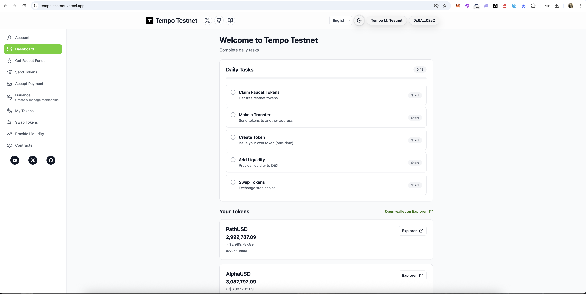
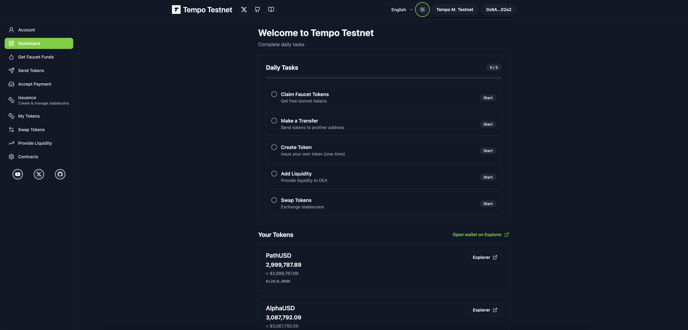

# Tempo Testnet App

A small web app for interacting with the **Tempo Moderato Testnet** (wallet connect, faucet, transfers, token tools, and the Stablecoin DEX).

Important:
- This is an **unofficial** community-made demo UI / guide, built using publicly available Tempo docs and deployed contract interfaces.
- Not affiliated with Tempo.

Live (production): https://tempo-testnet.vercel.app

YouTube demo: https://www.youtube.com/watch?v=PM1m87ASxmQ

## What you can do

- View your testnet token balances
- Claim faucet funds
- Send TIP-20 tokens
- Create & manage TIP-20 stablecoins (issuance)
- Swap stablecoins
- Provide liquidity / market making (advanced tools available)
- Check useful contract addresses / links

## Screenshots

Light mode:



Dark mode:



## Getting started

**Requirements:** Node.js 18+ and npm.

1) Install deps

```bash
npm install
```

2) Create your env file

```bash
cp .env.example .env.local
```

Notes:
- Prefer `.env.local` for local development (do not commit it).
- The repo ignores `.env*.local` by default.

If you deploy the app under a subpath (e.g. GitHub Pages), set:

- `VITE_BASE_PATH=/Tempo-Testnet/`

3) (Optional) Set WalletConnect project id

Open `.env.local` and set:

- `VITE_WALLETCONNECT_PROJECT_ID=`

If you want iOS/Safari users to see mobile wallet options in the Connect modal, a WalletConnect Project ID is required.

4) Run locally

```bash
npm run dev
```

Build / preview:

```bash
npm run build
npm run preview
```

## Deployment

### Vercel

This repo includes a `vercel.json` configured for Vite + SPA routing. In Vercel Project Settings, set any needed env vars (e.g. `VITE_WALLETCONNECT_PROJECT_ID`) and deploy.

## Add Tempo Testnet to your wallet

Most wallets will prompt you to switch networks when you connect. If you need to add it manually (e.g. MetaMask):

1) Open **Settings** → **Networks** → **Add network** → **Add a network manually**

2) Enter these values

- Network name: `Tempo Moderato Testnet`
- RPC URL: `https://rpc.moderato.tempo.xyz`
- Chain ID: `42431`
- Currency symbol: `USD`
- Block explorer: `https://explore.tempo.xyz`

## Notes

- This app targets **Tempo Moderato Testnet** (chain id `42431`). If your wallet is on the wrong network, the UI will ask you to switch.
- RPC default: `https://rpc.moderato.tempo.xyz`
- Explorer: `https://explore.tempo.xyz`

## Copyright

© Tempo Testnet App. All rights reserved.

## Scripts

- `npm run lint`
- `npm run format`
- `npm run smoke:contracts`
- `npm run diag:fee-token`

## Fee Token Diagnostics

If `setUserToken` fails in-wallet with a generic "Internal JSON-RPC error", you can diagnose the on-chain requirements and run a safe preflight simulation from the terminal.

1) Put these in your `.env.local` (recommended) or `.env`:

- `USER_TOKEN=0x...` (your TIP-20)
- `ACCOUNT_ADDRESS=0x...` (your wallet address)

2) Run:

```bash
npm run diag:fee-token
```

This runs `simulateContract(setUserToken)` and prints currency, balances, pool reserves, and any available revert selector data.

Optional: to broadcast `setUserToken` from the script, set `PRIVATE_KEY` and `SEND_TX=1` locally (never share or commit secrets).
